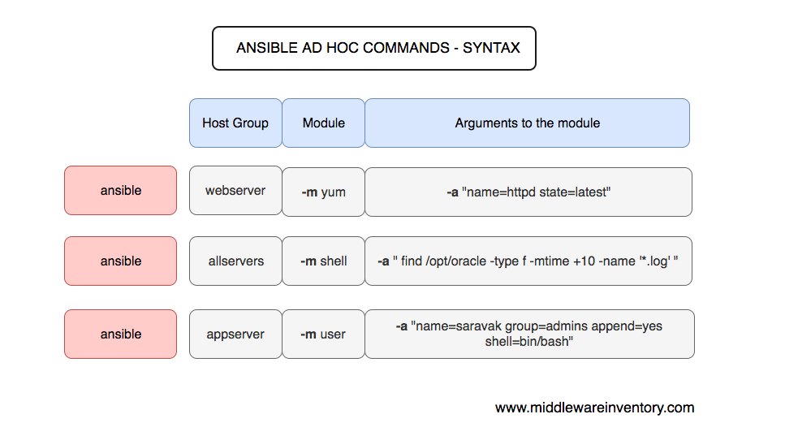
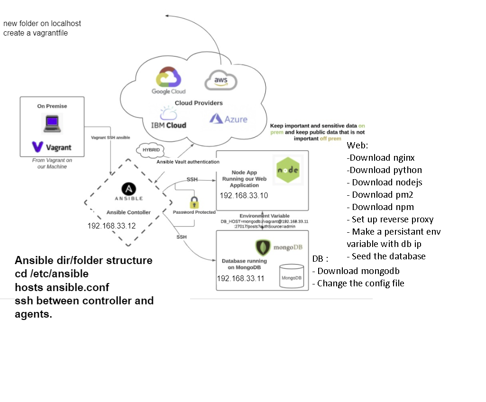
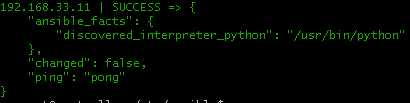
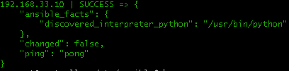
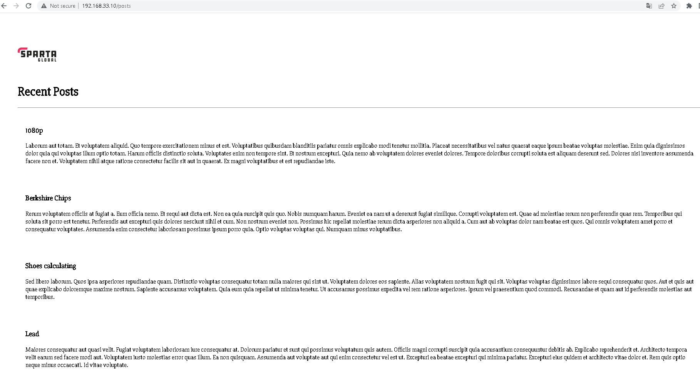
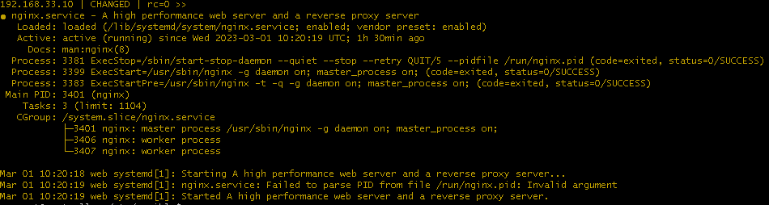

## What is Infrastructure as code (IaC)
* Helps codify everything
* Helps us build and delete things
* Infrastructure as code (IaC) uses DevOps methodology and versioning with a descriptive model to define and deploy infrastructure, such as networks, virtual machines, load balancers, and connection topologies. Just as the same source code always generates the same binary, an IaC model generates the same environment every time it deploys
* Ansible configuration management
* Terraform orchestration
* IaC evolved to solve the problem of environment drift in release pipelines. Without IaC, teams must maintain deployment environment settings individually. Over time, each environment becomes a "snowflake," a unique configuration that can't be reproduced automatically
* Inconsistency among environments can cause deployment issues. Infrastructure administration and maintenance involve manual processes that are error prone and hard to track
* IaC avoids manual configuration and enforces consistency by representing desired environment states via well-documented code in formats such as JSON
* Infrastructure deployments with IaC are repeatable and prevent runtime issues caused by configuration drift or missing dependencies. Release pipelines execute the environment descriptions and version configuration models to configure target environments. To make changes, the team edits the source, not the target
* Idempotence, the ability of a given operation to always produce the same result, is an important IaC principle
* A deployment command always sets the target environment into the same configuration, regardless of the environment's starting state. Idempotency is achieved by either automatically configuring the existing target, or by discarding the existing target and recreating a fresh environment.
## Configuration management
* Configuration Management is the process of maintaining systems, such as computer hardware and software, in a desired state.
## Orchestration
* Orchestration is the automated configuration, management, and coordination of computer systems, applications, and services
## IaC software
* Terraform.
* Ansible.
* AWS CloudFormation.
* Azure Resource Manager.
* Google Cloud Deployment Manager.
* Chef.
* Puppet.
* SaltStack.
## Terraform
* Terraform is an infrastructure as code tool that lets you build, change, and version cloud and on-prem resources safely and efficiently
* Not cloud dependent, can use with any cloud provider, same as ansible
## Ansible
* Simple and powerful
* Agentless -> dont need ansible installed in every agent node
* Communicates with SSH
* Uses python
* Implement configuration management for IaC
* Uses YAMAL as a language
* Ansible is the simplest way to automate apps and IT infrastructure. Application Deployment + Configuration Management + Continuous Delivery.
* Ansible can be used to provision the underlying infrastructure of your environment, virtualized hosts and hypervisors, network devices, and bare metal servers. It can also install services, add compute hosts, and provision resources, services, and applications inside of your cloud
## Push pull configuration
* Pull Model: The nodes are dynamically updated with the configurations that are present in the server
* Push Model: Centralized server pushes the configurations on the nodes
## Who is using IaC
* Home office
* Sky
* Banking


## Setting up 3 vms using ansible
* First, enter this code block into a `VagrantFile`:
```ruby
# ansible-tech201


# -*- mode: ruby -*-
 # vi: set ft=ruby :
 
 # All Vagrant configuration is done below. The "2" in Vagrant.configure
 # configures the configuration version (we support older styles for
 # backwards compatibility). Please don't change it unless you know what
 
 # MULTI SERVER/VMs environment 
 #
 Vagrant.configure("2") do |config|
    # creating are Ansible controller
      config.vm.define "controller" do |controller|
        
       controller.vm.box = "bento/ubuntu-18.04"
       
       controller.vm.hostname = 'controller'
       
       controller.vm.network :private_network, ip: "192.168.33.12"
       
       # config.hostsupdater.aliases = ["development.controller"] 
       
      end 
    # creating first VM called web  
      config.vm.define "web" do |web|
        
        web.vm.box = "bento/ubuntu-18.04"
       # downloading ubuntu 18.04 image
    
        web.vm.hostname = 'web'
        # assigning host name to the VM
        
        web.vm.network :private_network, ip: "192.168.33.10"
        #   assigning private IP
        
        #config.hostsupdater.aliases = ["development.web"]
        # creating a link called development.web so we can access web page with this link instread of an IP   
            
      end
      
    # creating second VM called db
      config.vm.define "db" do |db|
        
        db.vm.box = "bento/ubuntu-18.04"
        
        db.vm.hostname = 'db'
        
        db.vm.network :private_network, ip: "192.168.33.11"
        
        #config.hostsupdater.aliases = ["development.db"]     
      end
    
    
    end
```
* Update and upgrade all 3 machines : controller, web, db
```
sudo apt update
```
```
sudo apt upgrade -y
```
* Need to install ansible on controller machine
1) Install python :
```
sudo apt-get install software-properties-common
```
2) Install ansible repository :
``` 
sudo apt-add-repository ppa:ansible/ansible
```
3) Run an update:
```
sudo apt update
```
4) Install ansible: 
```
sudo apt install ansible -y
```
5) Check the ansible version
```
ansible --version
```
6) SSH into web VE from controller, the numbers after @ are the ip for the web VE:
``` 
ssh vagrant@192.168.33.10
```
## Additional information
* Inside the controller VE where ansible is installed, the absolute path is /etc/ansible
* This will have both the `hosts` and `ansible.conf` files

## Ansible
* Adhock commands can be used from the control manager (ansible terminal) to interact with agent nodes
* Can use ad-hock commands
* Scripts in ansible are called playbooks, and they are written in YAMAL language
* ` Vagrant status` -> outputs running state of every machine
* ` sudo apt update && upgrade -y` -> runs update and upgrade consequtively
* Can SSH into all 3 machines from local machine, that means communication is effective
* Now want to SSH into nodes from controller
* Controller runs request to web node
* Key wont match because key it isn't copied
* Need to configure the web agent node ip in the control node hosts file, which has the following path: `/etc/ansible/hosts`
1) On the controller VE, navigate to /etc/ansible
2) Edit the host file to allow the web machine:
```
192.168.33.10 ansible_connection=ssh ansible_ssh_user=vagrant ansible_ssh_pass=vagrant
```
3) Should now be able to run:
```
sudo ansible -m ping web
```
* This should return a positive `pong` response, which means that the two machines can communicate
## Potential blockers - Fail to use ssh key
* On the web VE:
1) Navigate to ssh folder:
```
cd /etc/ssh
```
2) Edit the sshd_config file:
```
sudo nano sshd_config
```
3) Make sure the following lines are uncommented, if they are not in the file add them:
* PermitRootLogin prohibit-password
* PasswordAuthentication yes
* ChallengeResponseAuthentication no
* UsePAM yes
* X11Forwarding yes
* PrintMotd no
* AcceptEnv LANG LC_*
* Subsystem       sftp    /usr/lib/openssh/sftp-server
* UseDNS no
* GSSAPIAuthentication no
4) Save and exit -> `CTRL + x` -> `y` -> `ENTER`
5) Restart ssh to save the changes:
```
sudo systemctl restart ssh
```
* On the controller VE:
1) Navigate to /etc/ansible
2) Edit the ansible.cfg file:
```
sudo nano ansible.cfg
```
3) Under [default], add the following line:
```
host_key_checking = false
```
4) Save and exit -> `CTRL + x` -> `y` -> `ENTER`
* You should now be able to ping the web node and receive a positive pong response
## Ad hoc commands



* Ad hoc commands use the /usr/bin/ansible command-line tool to automate a single task on one or more managed nodes
* The are quick and easy, but they are not reusable
* Ping command tries to SSH in and checks the status code -> `sudo ansible -m ping web/db`
* If status code is 200, gives response pong
* If the code is anything else, it gives the reason
* `sudo ansible web -a "uname -a"` -> runs uname -a in the target VE using ansible, in this case web
* `sudo ansible web -a "date"` -> prints the date of the target nodes location
* `sudo ansible all -a "free -m"` -> prints the availalble hardrive space in all VEs
* `sudo ansible all -a "ls -a"` -> prints hidden files in target VE
* `sudo ansible all -a "uptime"` ->  prints the current time, the length of time the system has been up, the number of users online, and the load average
* `ansible web -m ansible.builtin.copy -a "src=test.txt dest=test.txt"` -> copies a file from the controller node to the agent node
* `sudo ansible web -a "systemctl status nginx"` -> checks the status of nginx on the web agent node
* `sudo ansible db -a "systemctl status mongodb"` -> checks the status of mongodb on the db agent node
## Why use ansible ad hoc commands
* Easy way to perform quick, 1 line tasks on any number of agent nodes without ssh'ing in to each one
## Playbooks
* Playbooks are the ansible equivalent of shell scripts, they are files which store code and logic which can be used to execute many commands in the target group
* Playbooks files are defined by having the `.yml` ending, e.g. `script.yml`
* Playbooks are written in `YAML`, which stands for `Yet Another Markup Language`
* `YAML` is a digestible data serialization language used to create configuration files (playbooks)
* `YAML` is a strict superset of JSON
* Because it’s a strict superset, it can do everything that JSON can and more
* Indentation is very important in `YAML` playbooks
## Provisioning with YAML



### Requirements- db
1) Install mongodb
2) Configure mongodb
### Requirements- web
1) Install nginx 
2) Configure reverse proxy
3) Install nodejs
4) Install pm2
5) install npm
6) Make a persistent environmental variable with db ip
7) Seed the database

## Additional ansible information
* states -> state=present, state=absent
* Run the playbook -> sudo ansible-playbook `<playbook_name>` e.g: sudo nano nginx-playbook.yml
* Provisioning can only be used for 1 machine, playbooks can be used in any number of machines
* Check if control node can communicate with an agent node : `sudo ansible -m ping web/db`

## Setting up app and db -> configuring DB
1) Make sure that your controller and and db agent node can communicate:
```
sudo ansible -m ping db
```
* You should see the following output:



2) Make a playbook file which will we used to clone the repository with the environment:
```
sudo nano import-db-playbook.yml
```
3) Inside the file, enter the following:
```yml
---
- hosts: db
  gather_facts: yes
  become: true

  tasks:
  - name: Clone repository with environment folder
    git:
      repo: your repo https
      dest: path where you want to clone the repo to e.g. /home/db
      clone: yes
      update: yes
```
4) Run the playbook to clone the repository into your db agent node
```
sudo ansible-playbook import-db-playbook.yml
```
5) Make a playbook to install and configure mongodb:
```
sudo nano db-provision-playbook.yml
```
6) Enter the following code into the file:
```yml

---

- hosts: db

  gather_facts: yes

  become: true

  tasks:
  - name: install mongodb
    apt: pkg=mongodb state=present

  - name: Remove mongodb file (delete file)
    file:
      path: /etc/mongodb.conf
      state: absent

  - name: Touch a file, using symbolic modes to set the permissions (equivalent to 0644)
    file:
      path: /etc/mongodb.conf
      state: touch
      mode: u=rw,g=r,o=r


  - name: Insert multiple lines and Backup
    blockinfile:
      path: /etc/mongodb.conf
      block: |
        # mongodb.conf
        storage:
          dbPath: /var/lib/mongodb
          journal:
            enabled: true
        systemLog:
          destination: file
          logAppend: true
          path: /var/log/mongodb/mongod.log
        net:
          port: 27017
          bindIp: 0.0.0.0

  - name: Restart mongodb
    become: true
    shell: systemctl restart mongodb

  - name: enable mongodb
    become: true
    shell: systemctl enable mongodb

  - name: start mongodb
    become: true
    shell: systemctl start mongodb
```
7) Run the playbook to change the mongodb configuration:
```
sudo ansible-playbook db-provision-playbook.yml
```
## Setting up app and db -> configuring web -> import repository
1) Make sure that the controller node and the web agent node can communicate:
```
sudo ansible -m ping web
```
* You should see the following output:



2) Make a yaml file for our playbook which will clone our repository with our app into the web agent node:
```
sudo nano import-web-playbook.yml
```
3) Enter the following code:
```yml
---
- hosts: web
  gather_facts: yes
  become: true

  tasks:
  - name: Clone repository with app folder
    git:
      repo: your repo https
      dest: path where you want to clone the repo to ,e.g. /home/repo
      clone: yes
      update: yes
```
3) Run the playbook to clone the repository:
```
sudo ansible-playbook import-web-playbook.yml
```
## Setting up app and db -> configuring web -> set up nginx and reverse proxy
1) Make a yaml file for the reverse proxy playbook:
```
sudo nano reverse-proxy-playbook.yml
```
2) Enter the following:
```yml
---
- hosts: web
  gather_facts: yes
  become: true

  tasks:
  - name: Install nginx
    apt: pkg=nginx state=present

  - name: Disable nginx Default Virtual Host
    become: yes
    ansible.legacy.command:
     cmd: unlink /etc/nginx/sites-enabled/default

  - name: Create nginx conf file
    become: yes
    file:
      path: /etc/nginx/sites-available/node_proxy.conf
      state: touch

  - name: Amend nginx conf file
    become: yes
    blockinfile:
     path: /etc/nginx/sites-available/node_proxy.conf
     marker: ""
     block: |
       server {
           listen 80;
           location / {
                proxy_pass http://192.168.33.10:3000;
            }
        }
  - name: Link nginx Node Reverse Proxy
    become: yes
    command:
      cmd: ln -s /etc/nginx/sites-available/node_proxy.conf /etc/nginx/sites-enabled/node_proxy.conf

  - name: Make sure nginx service is running
    become: yes
    service:
      name: nginx
      state: restarted
      enabled: yes
```
3) Run the playbook to initialise the reverse proxy:
```
sudo ansible-playbook reverse-proxy-playbook.yml
```
## Setting up app and db -> configuring web -> setting up app dependencies and launching the app
1) Make a a yaml file which will store our playbook:
```
app-provision-playbook.yml
```
2) Enter the following code:
```yml
---
- hosts: web
  gather_facts: yes
  become: true

  tasks:

  - name: Add environmental variable
    shell:  echo 'export DB_HOST="mongodb://192.168.33.11:27017/posts"' >> ~/.bashrc && source .bashrc
    args:
      executable: /bin/bash

  - name: Link nginx Node Reverse Proxy
    become: yes
    command:
      cmd: ln -s /etc/nginx/sites-available/node_proxy.conf /etc/nginx/sites-enabled/node_proxy.conf

  - name: Make sure nginx service is running
    become: yes
    service:
      name: nginx
      state: restarted
      enabled: yes

  - name: Install node
    register: out

    shell: |
      sudo apt update && sudo apt upgrade
      cd /home/repo/app
      sudo apt -y install curl dirmngr apt-transport-https lsb-release ca-certificates
      curl -sL https://deb.nodesource.com/setup_12.x | sudo -E bash -
      sudo apt update
      sudo apt -y install nodejs 
      sudo npm install pm2 -g
  - name: Start the app
    shell: |
      cd /home/repo/app    
      node seeds/seed.js
      npm install
      pm2 kill
      pm2 start app.js
      printenv DB_HOST
  - debug: var=out.stdout_lines
```
3) Run the playbook to install dependencies and run the app in the background:
```
sudo ansible-playbook app-provision-playbook.yml
```
4) You should now be able to see your app with /posts in your browser, without specifying the port number:



## Potential blockers
### Cannot GET posts
1) `Database isnt seeding properly` -> Make sure you have `node seeds/seed.js` in your playbook and that it is running
2) `PORT 3000 is already occupied by a root service` -> Use ad hock commands to find what the `PID` is of the process occupying port 3000, then kill that process:
```
sudo ansible web -a "sudo lsof -i :3000"
```
* Then use the pid of the process occupying port 3000 to kill it:
```
sudo ansible web -a "sudo kill -9 PID"
```
* Now try re-running the playbook (if your reverse proxy configuration is in the same playbook as your other app dependencies, you will need to comment out the reverse proxy steps if running the playbook more than once)
### Error 502 bad gateway
1) `nginx configuration is damaged` -> Check the nginx status:
```
sudo ansible web -a "systemctl status nginx"
```



* If the status is running as it is above, check the config file:
```
cd /etc/nginx/sites-available
```
* If using default configuration, run the following command and see if there are mistakes in the default configuration:
```
cat default
```
* If following this guide to set up the reverse proxy, view the following file instead:
```
cat node_proxy.conf
```
* If that configuration is accurate, revisit your playbook and make sure that **either** the default **or** the node_proxy.conf file is linked. For the reverse proxy, use the following :
```yml
 - name: Link nginx Node Reverse Proxy
    become: yes
    command:
      cmd: ln -s /etc/nginx/sites-available/node_proxy.conf /etc/nginx/sites-enabled/node_proxy.conf
```
* For the default its:
```yml
- name: Link nginx Node Reverse Proxy
    become: yes
    command:
      cmd: ln -s /etc/nginx/sites-available/default /etc/nginx/sites-enabled/default
```
* Then make sure to restart and enable nginx
```yml
- name: Make sure nginx service is running
    become: yes
    service:
      name: nginx
      state: restarted
      enabled: yes
```
2) `Tried running the script before importing the repository with the app folder` -> Destroy the web VE and realunch it, when you being provisioning it, run the playbook to import the repository before you run the app configuration playbook
* In the gitbash terminal, destroy the web VE:
```
vagrant destroy web
```
* You will then be asked to confirm , `ENTER y`
* Relaunch the web VE:
```
vagrant up web
```
## Hybrid ansible
* Automate process of making ec2 instance
* Controller locally available, therefore need authentication to send request to AWS
* Need to encrypt keys
* Use ansible vault -> encrypts keys
* Put keys into vault, use password on vault, use password instead of keys
* Create a playbook that creates an ec2 instance
* All of the instance information needs to be in the playbook
* Need .pem file in playbook
* Need to generate ssh key pair
* call the key the same name as the pem file devops-tech201
* Once controller has key, need to tell it which key to use
* Get playbook to attach key to instance
## Ansible vault
* Provides security
* Folder structure /etc/ansible/group_vars/all/pass.yml -> provide keys in .yml file
* aws_access_key : key
* aws_secret_key : secret key
* use password: vagrant
* File needs permissions: sudo chmod 400 file.pem
* Copy .pub file to ec2 instance using yaml playbook
* sudo ansible-playbook ec2.yml --ask-vault-pass --tags create_ec2
## vi editor
* press i until you see insert
* To save :
* Press `ESC -> :wq! -> ENTER`
* sudo apt install tree
* sudo ansible-vault create pass.yml
* use vagrant password
* sudo chmod 666 pass.yml
* Force ubuntu to use python 3 -> `alias python=python3`
## Setting up hybrid ansible with EC2 -> Installing dependencies
**NOTE- All of these steps will be carried out in the control node/ controller VE**
1) Update the machine:
```
sudo apt update
```
2) Install tree module to visualise file structure more clearly:
```
sudo apt install tree -y
```
3) Update your ansible repository:
```
sudo apt-add-repository --yes --update ppa:ansible/ansible
```
4) Install ansible:
```
sudo apt install ansible -y
```
5) Install python3 package manager:
```
sudo apt install python3-pip
```
6) Use the package manager to install aws command line:
```
pip3 install awscli
```
7) Use the package manager to install boto and boto3:
```
pip3 install boto boto3 -y
```
8) Update the machine:
```
sudo apt update
```
9) Upgrade the machine:
```
sudo apt upgrade
```
10) Force ubuntu to use python3:
```
alias python=python3
```
## Securing AWS key in vault
1) Navigate to the ansible directory:
```
cd /etc/ansible
```
2) Create the required folder structure:
```
mkdir /group_vars/all
```
3) Navigate to `all`:
```
cd /etc/ansible/group_vars/all
```
4) Make the vault:
```
ansible-vault create pass.yml
```
5) Press `i` until you see `insert`
6) Type
``` 
aws_access_key: your aws access key
```
7) On another line, type:
```
aws_secret_key: your aws secret key
```
8) If it asks you for a password, set it to `vagrant` for ease of use
9) Change the file permissions on `pass.yml`:
```
sudo chmod 666 pass.yml
```
## Importing aws .pem file and making ssh keys
1) Navigate to the .ssh folder:
```
cd ~/.ssh
```
2) Copy the key in your `.pem` file in your gitbash that you use to sign into to aws
3) Make a file with the same name in the controller node .ssh folder:
```
sudo nano devops-tech201
```
4) Inside the file, paster your `.pem` key
5) Save and exit
6) Change the key permissions so that it is secure:
```
sudo chmod 400 devops-tech201
```
7) Generate a new pair of ssh keys for use in the playbook. For ease of use, name the keys the same as the .pem file, for example, my .pem file is devops-tech201:
```
ssh-keygen -t rsa -b 4096 -f ~/.ssh/devops-tech201
```
## Making the playbook
1) Navigate to the ansible directory:
```
cd /etc/ansible
```
2) Make a playbook file:
```
sudo nano playbook.yml
```
3) Inside the playbook, enter the following code:
```
---

- hosts: localhost
  connection: local
  gather_facts: False

  vars:
    key_name: devops_tech201
    region: eu-west-1
    image: ami-0495f6e6ed224deb2
    id: "benas_tech201_playbook_app"
    sec_group: "sg-029fd90fcce43fc1f"
    ansible_python_interpreter: /usr/bin/python3

  tasks:

    - name: Facts
      block:

      - name: Get instances facts
        ec2_instance_facts:
          aws_access_key: "{{aws_access_key}}"
          aws_secret_key: "{{aws_secret_key}}"
          region: "{{ region }}"
        register: result

      - name: Instances ID
        debug:
          msg: "ID: {{ item.instance_id }} - State: {{ item.state.name }} - Public DNS: {{ item.public_dns_name }}"
        loop: "{{ result.instances }}"

      tags: always


    - name: Provisioning EC2 instances
      block:

      - name: Upload public key to AWS
        ec2_key:
          name: "{{ key_name }}"
          key_material: "{{ lookup('file', '~/.ssh/{{ key_name }}.pub') }}"
          region: "{{ region }}"
          aws_access_key: "{{aws_access_key}}"
          aws_secret_key: "{{aws_secret_key}}"


      - name: Provision instance(s)
        ec2:
          aws_access_key: "{{aws_access_key}}"
          aws_secret_key: "{{aws_secret_key}}"
          key_name: "{{ key_name }}"
          id: "{{ id }}"
          group_id: "{{ sec_group }}"
          image: "{{ image }}"
          instance_type: t2.micro
          region: "{{ region }}"
          wait: true
          count: 1
          instance_tags:
            Name: benas_tech201_playbook_app

      tags: ['never', 'create_ec2']
```
5) Replace the variables with your own
6) Use the playbook to create the ec2 instance:
```
ansible-playbook playbook.yml --ask-vault-pass --tags create_ec2
```
7) When it asks you for the password, enter `vagrant`
* The instance should now be made
## Ping your EC2 Instance
1) Navigate to your ansible hosts file:
```
sudo nano /etc/hosts/hosts
```
2) Add aws configuration line:
```
[aws]
ec2-instance ansible_host=your.EC2.instance.public.ipv4.ip ansible_user=ubuntu ansible_ssh_private_key_file=~/.ssh/your_aws_key.pem
```
3) Ping the EC2 instance:
```
sudo ansible -m ping aws
```
## Potential blockers-- python3 isnt being used
* Add aline forcing ubuntu to use python 3 into your ansible hosts file:
1) Navigate to ansible hosts:
```
sudo nano /etc/ansible/hosts
```
2) Force ubuntu to use python3 by entering this line:
```
[local]
localhost ansible_python_interpreter=/usr/local/bin/python3
```


