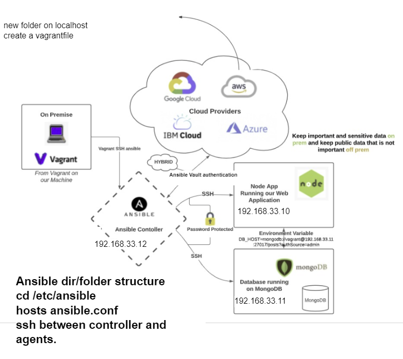

## What is Infrastructure as code (IaC)
* Helps codify everything
* Helps us build and delete things
* 
* Infrastructure as code (IaC) uses DevOps methodology and versioning with a descriptive model to define and deploy infrastructure, such as networks, virtual machines, load balancers, and connection topologies. Just as the same source code always generates the same binary, an IaC model generates the same environment every time it deploys
* Ansible configuration management
* Terraform orchestration
* IaC evolved to solve the problem of environment drift in release pipelines. Without IaC, teams must maintain deployment environment settings individually. Over time, each environment becomes a "snowflake," a unique configuration that can't be reproduced automatically
*  Inconsistency among environments can cause deployment issues. Infrastructure administration and maintenance involve manual processes that are error prone and hard to track
* IaC avoids manual configuration and enforces consistency by representing desired environment states via well-documented code in formats such as JSON
* Infrastructure deployments with IaC are repeatable and prevent runtime issues caused by configuration drift or missing dependencies. Release pipelines execute the environment descriptions and version configuration models to configure target environments. To make changes, the team edits the source, not the target
* Idempotence, the ability of a given operation to always produce the same result, is an important IaC principle
* A deployment command always sets the target environment into the same configuration, regardless of the environment's starting state. Idempotency is achieved by either automatically configuring the existing target, or by discarding the existing target and recreating a fresh environment.
## Configuration management
* Configuration Management is the process of maintaining systems, such as computer hardware and software, in a desired state.
## Orchestration
* Orchestration is the automated configuration, management, and coordination of computer systems, applications, and services
* Terraform.
* Ansible.
* AWS CloudFormation.
* Azure Resource Manager.
* Google Cloud Deployment Manager.
* Chef.
* Puppet.
* SaltStack.
## Terraform
* Terraform is an infrastructure as code tool that lets you build, change, and version cloud and on-prem resources safely and efficiently
* Not cloud dependent, can use with any cloud provider, same as ansible
## Ansible
* Simple and powerful
* Agentless -> dont need ansible installed in every agent node
* Communicates with SSH
* Uses python
* 
* Implement configuration management for IaC
* Uses YAMAL as a language
* Ansible is the simplest way to automate apps and IT infrastructure. Application Deployment + Configuration Management + Continuous Delivery.
* Ansible can be used to provision the underlying infrastructure of your environment, virtualized hosts and hypervisors, network devices, and bare metal servers. It can also install services, add compute hosts, and provision resources, services, and applications inside of your cloud
## Push pull configuration
* Pull Model: The nodes are dynamically updated with the configurations that are present in the server
* Push Model: Centralized server pushes the configurations on the nodes
## Who is using IaC
* Home office
* Sky
* Banking
* sudo ansible -m ping web/all



* Need to install ansible on controller machine
1) Install python :
```
sudo apt-get install software-properties-common
```
2) Install ansible repository :
``` 
sudo apt-add-repository ppa:ansible/ansible
```
3) Run an update:
```
sudo apt update
```
4) Install ansible: 
```
sudo apt install ansible -y
```
5) Check the ansible version
```
ansible --v
```
6) SSH into web VE from controller, the numbers after @ are the ip for the web VE:
``` 
ssh vagrant@192.168.33.10
```
## Additional information
* Inside the controller VE where ansible is installed, the absolute oath is /etc/ansible
* This will have both the `hosts` and `ansible.conf` files